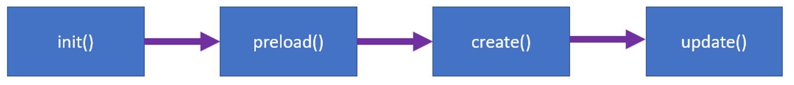

# Mario Style Platformer Game made in Phaser3

1. [Starting](#Starting)
2. [Arcade Basics](#Arcade-Basics)
3. [Static and dinamic bodies](#Static-and-dinamic-bodies)
4. [Player wlaking](#Player-wlaking)
5. [Player jumping](#player-jumping)
6. [Level data en json](#level-data-en-json)
7. [Fire and position](#fire-and-position)
8. [Detecting overlap](#detecting-overlap)
9. [Generatin barrils](#generatin-barrils)
10. [Pool of objects](#Pool-of-objects)

## Starting

- Create a new scene
~~~
let gameScene = new Phaser.Scene('Game');
~~~

- Some parameters for our scene
~~~
gameScene.init = function() {};
~~~

- Load asset files for our game
~~~
gameScene.preload = function() {

  // load images
  this.load.image('ground', 'assets/images/ground.png');

  // load spritesheets
  this.load.spritesheet('player', 'assets/images/player_spritesheet.png', {
    frameWidth: 28,
    frameHeight: 30,
    margin: 1,
    spacing: 1
  });

};
~~~

- Executed once, after assets were loaded
~~~
gameScene.create = function() {};
~~~

- Game's configuration
~~~
let config = {
  type: Phaser.AUTO,
  width: 360,
  height: 640,
  scene: gameScene,
  title: 'Monster Kong',
  pixelArt: false
};
~~~
- Create the game, and pass it the configuration
~~~
let game = new Phaser.Game(config);
~~~
## Arcade Basics
## Static and dinamic bodies
## Player wlaking
## Player jumping
## Level data en json
## Fire and position
## Detecting overlap
## Generatin barrils
## Pool of objects