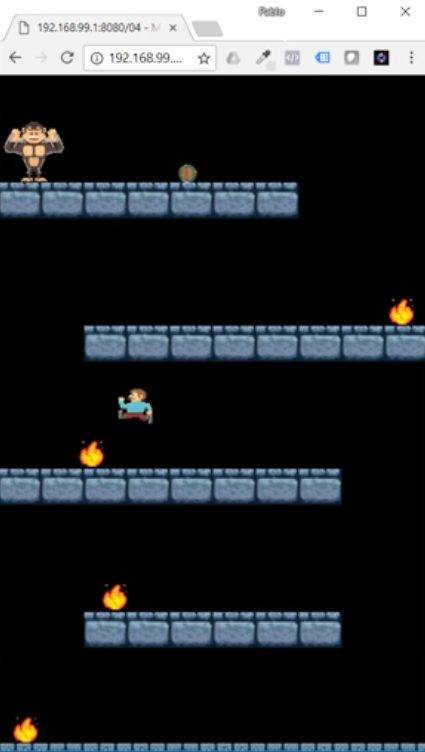

# Mario Style Platformer Game made in Phaser3

1. [Starting](#Starting)
2. [Arcade Basics](#Arcade-Basics)
3. [Static and dinamic bodies](#Static-and-dinamic-bodies)
4. [Player wlaking](#Player-wlaking)
5. [Player jumping](#player-jumping)
6. [Level data en json](#level-data-en-json)
7. [Fire and position](#fire-and-position)
8. [Detecting overlap](#detecting-overlap)
9. [Generatin barrils](#generatin-barrils)
10. [Pool of objects](#Pool-of-objects)

## Starting

- Create a new scene
~~~
let gameScene = new Phaser.Scene('Game');
~~~

- Some parameters for our scene
~~~
gameScene.init = function() {};
~~~

- Load asset files for our game
~~~
gameScene.preload = function() {

  // load images
  this.load.image('ground', 'assets/images/ground.png');

  // load spritesheets
  this.load.spritesheet('player', 'assets/images/player_spritesheet.png', {
    frameWidth: 28,
    frameHeight: 30,
    margin: 1,
    spacing: 1
  });

};
~~~

- Executed once, after assets were loaded
~~~
gameScene.create = function() {};
~~~

- Game's configuration
~~~
let config = {
  type: Phaser.AUTO,
  width: 360,
  height: 640,
  scene: gameScene,
  title: 'Monster Kong',
  pixelArt: false
};
~~~
- Create the game, and pass it the configuration
~~~
let game = new Phaser.Game(config);
~~~
## Arcade Basics
- We can create an sprite and add the physics system in two ways:
1) Create and add
~~~
  //Sprite creation
let barrel = this.add.sprite(180, 200, 'barrel');
//add sprite to the physics system
this.physics.add.existing(barrel);
~~~
2) Create and add in the same line
~~~
let ground = this.physics.add.sprite(180,200,'ground');
~~~
- We can also add physics to our game adding this lines of code to the game configuration 
~~~
physics:{
  default: 'arcade',
  arcade: {
    gravity: {y:1000},
    debug: true
  }
}
~~~
## Static and dinamic bodies
### Adding Physic System
- Once I have the sprite created, I can add it a physic system
~~~
let ground = this.add.sprite(180,400,'ground');
//add sprite to the physics system
this.physics.add.existing(ground, true); // true means that the sprite is static
~~~
### Creating TileSrpites
- The order of the parametres are: (posX, posY, numbersOfTiles * withOftile , numbersOfTiles * heigthOftile, sprite)
~~~
let platform = this.add.tileSprite(180, 300, 4*36,1*30, 'block');
~~~
### Creating Groups
- In the next example, platforms is the name of the group
~~~
this.platforms = this.add.group();
~~~
- Then, I can add a sprite to the group with the following line:
~~~
this.platforms.add(ground); // ground is the name of the sprite
~~~
### Adding Collitions
- I can add collision between two sprites:
~~~
this.physics.add.collider(barrel, ground)
~~~
- Or between a sprite and a group:
~~~
this.physics.add.collider(barrel, this.platforms)
~~~
### Creating a player from a sprite sheet
~~~
this.player = this.add.sprite(180,100,'player',3); // 3 is the number of the frame
this.physics.add.existing(this.player);
~~~
## Player wlaking
## Player jumping
## Level data en json
## Fire and position
## Detecting overlap
## Generatin barrils
## Pool of objects